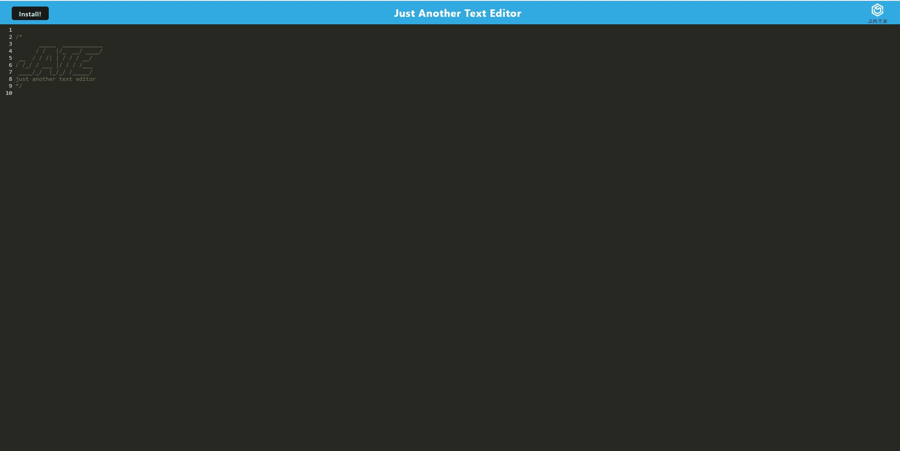

# pwa-text-editor

## Description
a installable text editor that can be used offline

### Table of Contents
- [License](#license)
- [Installation](#installation)
- [Usage](#usage)
- [Contributing](#contributing)
- [Tests](#tests)
- [Questions](#questions)

## License

This application is covered under the MIT license.

## Installation
go to link for deployed app and click intall button

## Usage
open app and you can type code or notes

## Contributors
Jacob McKitrick

## Tests

none

## Preview

Link to site: https://mckit-jate-pwa-c742b348524c.herokuapp.com/

## Questions
For any questions or inquiries, please contact me via GitHub or email:

GitHub: [MCKIT77](https://github.com/MCKIT77)

Email: jakemckit@gmail.com
